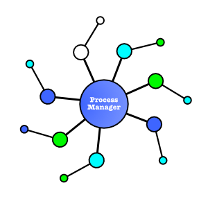

# PM2 for Electron



[PM2](http://pm2.keymetrics.io/) is a project that is stable, robust,
and well designed. However, when running for Electron, it has two
issues:

1. Electron has an internal filesystem format called [ASAR](https://github.com/electron/asar) which improves the performance of Electron apps. PM2 is unable to work with this format.
2. Electron distributes it's own (embedded) NodeJS. However, PM2 ignores this and requires the end user to install another version of NodeJS.

Hence I created this new "Process Manager". It can be used without
Electron of course but will also work perfectly with Electron without
any of the existing PM2 issues.

## Features

1. Start multiple processes
2. Start Python and NodeJS processes
3. Understands NodeJS modules (you can just point to the module folder)
4. WORKS WITH EMBEDDED Electron NodeJS
5. Stop any started process whenever you want
6. Direct the output to a log file
7. Set the working directory and environment if needed
8. Pass any required arguments to the scripts
9. KEEP-ALIVE: Automatically restarts the process if crashes (completely configurable)


## Usage

### Getting started

```javascript
const pm2 = require('@tpp/pm2')

pm2.start({
    script: 'path/to/script.py',
})
```

### Checking for errors with a callback

`pm2` functions take an optional callback that is invoked when there are
errors.

```javascript
pm2.start({
    script: 'path/to/script.py',
}, (err, pid) => {
    ...
})
```

The `start` callback can be invoked multiple times - for each error in
the process and when the process restarts. The callback also contains
the PID of the process when it starts. A callback without `pid` or `err`
means it has terminated cleanly.


### Passing arguments to scripts

```javascript
pm2.start({
    script: 'path/to/script.py',
    args: ['say','hello'],
})
```

### Setting Current Working Directory

```javascript
pm2.start({
    script: 'script.py',
    cwd: '/path/to/folder',
})
```

### Using Node modules

Because `pm2` understands Node modules we can simply point to the module
folder and it will pick up the correct starting point.

```javascript
pm2.start({
    cwd: '/path/to/npm/module/',
})
```

### Direct output to log file

```javascript
pm2.start({
    cwd: '/path/to/npm/module/',
    log: 'mylog.log',
})
```

### Stopping a process

In order to stop a process it needs to be given a name:

```javascript
pm2.start({
    name: 'my-process',
    cwd: '/path/to/npm/module/',
})

pm2.stop('my-process')
```

`stop` also takes an optional callback that will be called when
stopped/error.

```javascript
pm2.stop('my-process', (err) => {
    ...
})
```

### Stopping all processes

You can stop all running processes (named or un-named).

```javascript
pm2.stopAll()
```


### Restart a process

You can also restart a named process.

```javascript
pm2.restart('my-process')
```

Note that `restart` does not take a callback. It uses the same callback
you provided to `start`.


### Setting the environment

You can set the environment of the running process:

```javascript
pm2.start({
    script: 'path/to/script.py',
    env: ENVIRONMENT_OBJECT,
})
```


## Stopping Hook

If you want to clean up your sub-processes or simply stop cleanly in a
sub-process you can use the `onstopping` event handler:

```javascript
const pm2 = require('@tpp/pm2')
pm2.onstopping(() => {
    ...
})
```

Of course this only works if you're sub-process is a NodeJS module.


## Crashing & Restarts


By default `pm2` will restart any crashed processes. To prevent
'spinning' it will restart each time with a delay:

- First crash? Wait 100ms before restarting
- Crashed again? Wait 500ms before restarting
- Crashed again? Wait 1 second, then 10 seconds, then 30 seconds, then 1 minute, then 5 minutes before restarting
- Still crashing? Re-try every 15 minutes

If it has been running successfully for 30 minutes assume started ok.

This is all configurable using the `restartAt` and `restartOk`
parameters. The default parameters for the behaviour given above is:

```javascript
pm2.start({
    cwd: '/path/to/npm/module/',
    restartAt: [100, 500, 1*1000, 10*1000, 30*1000, 60*1000, 5*60*1000],
    restartOk: 30 * 60 * 1000,
})
```

You can design any restart strategy you want using the above parameters.

### No Restart
You can turn the restarting behaviour off completely by setting
`restartAt` to `[]` or `[0]`.


## Terminal Output coloring

In some cases the output of programs designed for the terminal can
contain [ANSI Escape Codes](https://en.wikipedia.org/wiki/ANSI_escape_code).
To remove them specify `stripANSI:true` as an option.

```javascript
pm2.start({
    cwd: '/path/to/npm/module/',
    log: 'mylog.log',
    stripANSI: true,
})
```

This is usually because you want a clean log file.


## TODO
[ ] Add Support for more process types (besides just python and node)
